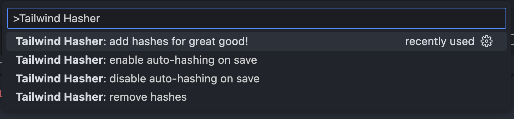

Tailwind Hasher is magical. It allows you to find the source of a tailwind class (or any atomic css system, e.g. UnoCSS, etc.) within your code base super easily.


The gist is, it adds a tiny random hash to the front of all `class` or `className` text.

Before:

```jsx
<div
  className={cn(
    'max-w-xl rounded-3xl px-6 py-5 relative group font-mono text-sm',
    isAssistant
      ? 'bg-primary text-primary-foreground'
      : 'bg-secondary text-secondary-foreground'
  )}>
```

After:

```jsx
<div
  className={cn(
    '0d0t0c3t max-w-xl rounded-3xl px-6 py-5 relative group font-mono text-sm',
    isAssistant
      ? 'bg-primary text-primary-foreground'
      : 'bg-secondary text-secondary-foreground'
  )}>
```

That way, you can search for `0d0t0c3t` in your code base, not `rounded-3xl px-6 py-5 relative group font-mono text-sm bg-primary text-primary-foreground`.

Which, PS, _will never match_, as that string does not exist in the code (as the Tailwind class is constructed dynamically!)

It works with all basic `class`/`className` constructions:

```jsx
<div className="0d0t0c3t max-w-3xl mx-auto w-full flex-1 overflow-y-auto grow px-0 py-6 space-y-8 max-h-[calc(100vh-12rem)] [&::-webkit-scrollbar]:hidden [-ms-overflow-style:none] [scrollbar-width:none] pb-14">
```

```html
<div
  class="0d0t0c3t max-w-3xl mx-auto w-full flex-1 overflow-y-auto grow px-0 py-6 space-y-8 max-h-[calc(100vh-12rem)] [&::-webkit-scrollbar]:hidden [-ms-overflow-style:none] [scrollbar-width:none] pb-14"
></div>
```

And works with all quote types: backtick, single-quote and double quote.

## Features

### Easy On The Eyes

The hash was specially design to be pleasant to look at. No UPPERCASE LETTERS! Ahhh. Relaxing.

### Saves Countless Minutes

No more crazy searches.

Simple troublshooting! Even in **huge** React/Tailwind codebases!

## FAQ

**Q. Why is this so awesome? And why didn't this exist before?!?**

A. Right?!?

**Q. How robust is the hash?**

A. There are 78,364,164,096 possible hashes. So birthday problem-wise, you will be okay with huge codebases. And if by some epically unlikely fluke you get a collision, just delete the hash & you will automagically get a new one. Phew!

**Q. Are the hashes stable?**

A. Yes! Once they are generated and assigned to a `class`/`className`, they don't change. So you can check into git, etc.

**Q. Is this designed for production code? Or just dev?**

A. Both! So much easier to troubleshoot production code when you can figure out the exact source of the issue!

## Extension Settings

You can access from the Command Palette, but in general better to just set to autosave?



This extension adds a toggler in the status bar to tsx/jsx files, allowing you to toggle auto hash on save. (It's recommened that you leave it on auto-save mode. Why not?)

## Known Issues

None, but feel free to log an issue if you come across one!

## Release Notes

### 1.0.1

Downgraded VS Code version to 1.96.0 work with Cursor AI.

### 1.0.0

Initial release of Tailwind Hasher. Woot!

---

Source code available at https://github.com/madasebrof/tailwind-class-hasher

**Enjoy!**
